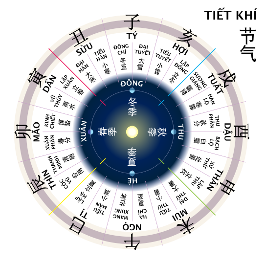

# amlich (lunar calendar)

Gives a lunar calendar given year, month, day

This is a Python adaptation program from a HTML/javascript page (source:http://www.informatik.uni-leipzig.de/~duc/amlich)

# What for ?

The lunar yera may contains 12 or 13 months. 

The leap month is a month (between 2 new moons) that does not contains a principal solar major term.

Solar terms 24 positions of the sun on the ecliptic every 15°. Major terms are positions muliple of 30° (Dong Chi, Dai Han, Vu Thuy, ..).

Dong Chi, Xuan Phan, Ha Chi, Thu Plan match respectively with Winter solstice, Spring equinox, Summer solstice, Autumn equinox.

The program will gives the location of the 13th month (called leap month) with respect to the solar calendar. 

# Classes (amlich_data.py)

Two classes : Tk_data, LunarDate

Tk_data gives the code for the year from TK tables defined in amlich_data.py

use : tk = Tk_dat(year)

1) tk data : 25 bits

    8 bits = day offset lunar new year day wrt solar new year day
    
    1 bit = leapmonthlenght (0=29, 1, 30)
    
    12 bits = regularMonthsLenght (0=29, 1=30)
    
    4 bits = leapMonth number

2) LunarDate : (dd, mm, yy, leap, jd)

    getYearInfo(yy) will give a list of LunarDate for each lunar month of yy 
    
# example 2025

|2025|New moons datetime  | Terms datetime | Principal terms | Maj/Min  | Lunar month |
| :-------------- | :------------ | :-------------: | -------------: | :------------ | :-------------: |
|0  |                   |    05/01 09:32     |   Tiểu hàn | Min    |   12/2024   |
|1  |                   |   20/01 03:00      |  Đại hàn   | Maj    |             |
|2  |       29/01 19:36 |  03/02 21:10       | Lập xuân   | Min    |            1|
|3  |                   |   18/02 17:06      |   Vũ Thủy  | Maj    |             |
|4  |       28/02 07:44 |   05/03 15:07      | Kinh trập  | Min    |            2|
|5  |                   |   20/03 16:01      | Xuân phân  | Maj    |             |
|6  |       29/03 17:57 |   04/04 19:48      | Thanh minh | Min    |            3|
|7  |                   |   20/04 02:56      |    Cốc vũ  | Maj    |             |
|8  |       28/04 02:31 |   05/05 12:57      |    Lập hạ  | Min    |            4|
|9  |                   |   21/05 01:54      |  Tiểu mãn  | Maj    |             |
|10 |       27/05 10:02 |   05/06 16:56      | Mang chủng | Min    |            5|
|11 |                   |   21/06 09:42      |    Hạ chí  | Maj    |             |
|12 |       25/06 17:31 |   07/07 03:05      |  Tiểu thử  | Min    |            6|
|13 |                   |   22/07 20:29      |   Đại thử  | Maj    |             |
|14 |       25/07 02:11 |   07/08 12:51      |   Lập thu  | Min    | 6 leap month=no Maj inside|
|15 |                   |   **23/08** 03:33  |    Xử thử  | Maj    | Maj date = next new moon|
|16 |   **23/08** 13:06 |   07/09 15:52      |   Bạch lộ  | Min    |            7|
|17 |       22/09 02:54 |   23/09 01:19      |  Thu phân  | Maj    |            8|
|18 |                   |   08/10 07:41      |    Hàn lộ  | Min    |             |
|19 |       21/10 19:25 |   23/10 10:51      | Sương giáng| Maj    |            9|
|20 |                   |   07/11 11:04      |  Lập đông  | Min    |             |
|21 |       20/11 13:47 |   22/11 08:35      | Tiểu tuyết | Maj    |           10|
|22 |                   |   07/12 04:04      |  Đại tuyết | Min    |             |
|23 |       20/12 08:43 |   21/12 22:03      |  Đông chí  | Maj    |           11|
