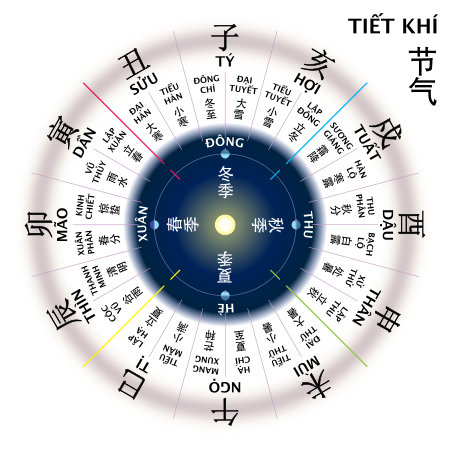

# amlich (lunar calendar)

Gives a lunar calendar given year, month, day

This is a Python adaptation program from a HTML/javascript page (source:http://www.informatik.uni-leipzig.de/~duc/amlich)

# What for ?

The lunar yera may contains 12 or 13 months. 

The leap month is a month (between 2 new moons) that does not contains a principal solar major term.

Solar terms 24 positions of the sun on the ecliptic every 15°. Major terms are positions muliple of 30°.

This will gives the location of the 13th month (called leap month) with respect to the solar calendar.

# Classes (amlich_data.py)

Two classes : Tk_data, LunarDate

Tk_data gives the code for the year from TK tables defined in amlich_data.py

use : tk = Tk_dat(year)

1) tk data : 25 bits

    8 bits = day offset lunar new year day wrt solar new year day
    
    1 bit = leapmonthlenght (0=29, 1, 30)
    
    12 bits = regularMonthsLenght (0=29, 1=30)
    
    4 bits = leapMonth number

2) LunarDate : (dd, mm, yy, leap, jd)

    getYearInfo(yy) will give a list of LunarDate for each lunar month of yy 
